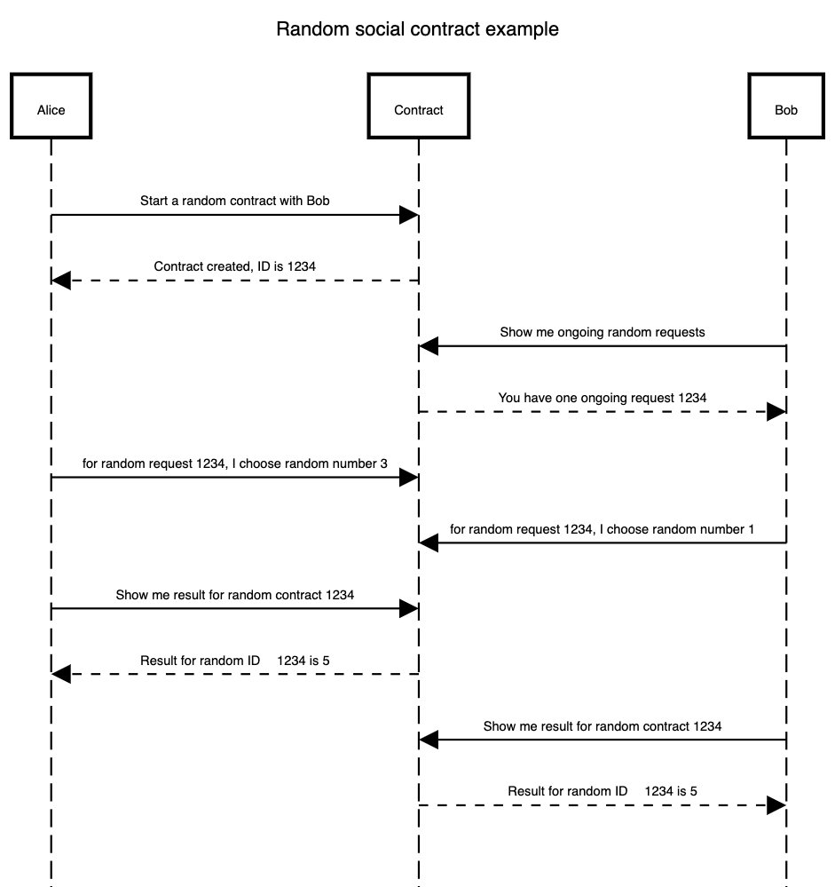

# Social Randomness.

##### Build fair and robust randomness when several parties are involved


### A standard random dice

**Simulate a dice, with a dApp involving 2 people**

The purpose of this app is to generate a random integer between 1 and 6 through a process involving 2 parties. 

To achieve this, we will build an application that lets its runner and another participant choose a number between 1 and 6. It will then add the two inputs, calculate the result modulo 6, and add 1. The final result is our random number.

**Rationale**: As long as the person running the contract and the other person choose a value randomly between 1 and 6 without communicating with one another, the result will be random.


**Sequence Diagram**

Sequence diagram generated using https://sequencediagram.org/ and the following code:

````
title Random social contract example

Alice->Contract: Start a random contract with Bob
Alice<--Contract: Contract created, ID is 1234
Bob->Contract: Show me ongoing random requests
Bob<--Contract: You have one ongoing request 1234
Alice->Contract: for random request 1234, I choose random number 3
Bob->Contract: for random request 1234, I choose random number 1
Alice->Contract: Show me result for random contract 1234
Alice<--Contract: Result for random ID 1234 is 5
Bob->Contract: Show me result for random contract 1234
Bob<--Contract: Result for random ID 1234 is 5
````




**Structure of the App. [Draft, described as an API]**

[We may use openapi format for a standard definition]

- POST /new
  	silent input: Wallet id of person doing the call
  	required input: Another wallet #

  [optional inputs]: Watchers
  ​	response: running_app_id

	error response:
		40x if missing input
		40x if some wallet format is incorrect

- PATCH /running_app_id
  	silent input: wallet id of person doing the call
  	required input: number 1-6
  	response: 200

	error response:
		404 if no such app is running
		40x unauthorized if this user is not expected to give input
		40x if input already provided by this user
		40x if value is incorrect (non numerical)
		40x if value is incorrect (not integer)
		40x if value is incorrect (not within 1-6 range)
	
	note: Can only be applied once. All subsequent submissions are ignored.
		  One must use the same wallet as the person who called the /new method

- GET /running_app_id
  	silent input: wallet id of person doing the call
  	required input: nil
  	response: 
  		- 1-6 result if available.
  		- Details about execution:
  			- List of Participants (it does not matter who started to run the instance).
  			- List of Watchers
  			- Global Running State: Initialised, Waiting some input(s), computing, finalised. 
  			- State of individual inputs (given/pending)
  			- IF all inputs have been received and computed:
  				- Final result
  				- Individual random inputs (Each participant can verify computation is fair).

	error response:
		40x Unauthorized if caller is not a participant of the random trial nor a watcher.

- GET /
  	silent input: wallet id of person doing the call
  	optional inputs: 
  		- Filters (state, etc.)
  		- Order By
  	response: List of all contacts where the person doing the call is involved.


**Example**


- First message sent by initiator of random request

[Creator] 

Method and request url:

````http
POST https:/myrandomserver.com/new
````

HEADER: 

````http
some-custom-value: wallet ID1 (plus some authorization !?)
````

BODY

````json
{
		"participants": ["wallet ID2"]
} 
````

   **response:**

HTTP Code

````http
200 OK
````

​	HEADER

````http
created: https:/myrandomserver.com/processes/893423
````

​	BODY

````json
{ 
	 "random-process-id": "893423"
}
````

- Second message sent by invitee of random request

[Invitee] 

````http
GET https:/myrandomserver.com/processes
````


​	HEADER

````http
some-custom-value: wallet ID2
````


   **response:**

HTTP Code

````http
200 OK
````

​	HEADER

````http
created: https:/myrandomserver.com/processes/893423
````

​	BODY

````json
[
	{ 
		"random-process-id": "893423"
    "status": ""
    xxx.
	} 
]
````

​			


- Third and fourth message sent by creator and invitee of random request. Both follow the same format

[Invitee] 

````http
PATCH https:/myrandomserver.com/processes/893423
````


​	HEADER

````http
some-custom-value: wallet ID2
````

BODY

````json
{ 
	 "random-value": 3
}
````

- 

   **response:**

HTTP Code

````http
200 OK	
````

[Requeter] 

````http
PATCH https:/myrandomserver.com/processes/893423
````


​	HEADER

````http
some-custom-value: wallet ID1
````

BODY

````json
{ 
	 "random-value": 1
}
````

- 

   **response:**

HTTP Code

````http
200 OK	
````


- The result can be found for both parties in subsequent messages


[Invitee or Requester] 

````http
GET https:/myrandomserver.com/processes/893423
````


​	HEADER

````http
some-custom-value: wallet ID1-2
````


   **response:**

HTTP Code

````http
200 OK
````

​	BODY

````json

	{ 
		"random-process-id": "893423"
    "status": ""
    "generated-value": 5
	} 

````

​		
